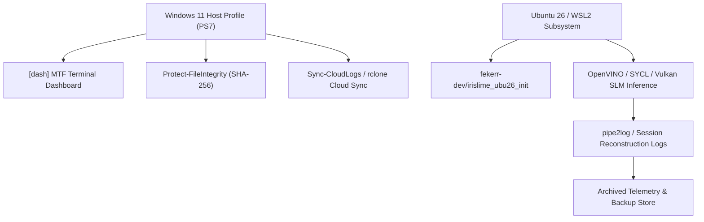

# Fekerr-Dev Host Integration & Operational Architecture

## 1. Executive Summary

This document formalizes the integration of the `fekerr-dev` host execution toolkit into the `irislime` edge AI sandbox. The architecture establishes a zero-trust, forensic-ready bridge between the Windows 11 PowerShell 7 host environment, virtualized container runtimes (Ubuntu 26 / WSL2), and cloud backup targets.

---

## 2. Core Operational Principles

All development within this repository adheres strictly to three immutable principles:

1. **Additive-Only Evolution**:
   - All changes, tools, scripts, and documentation updates are strictly additive.
   - Code features or experiments are retained across branches; active components are expanded without destructive refactoring of working foundations.

2. **Branch & File Preservation (Zero-Deletion Guarantee)**:
   - Git branches (local and remote) are preserved permanently for lineage tracing and reference.
   - Files and telemetry logs are never deleted from working space without archival. Items moved out of active operational paths are migrated downward into structured archive directories (`docs/`, `scratch/`, `rclone_cache/`) or synchronized to cloud storage.

3. **Idempotent Sandbox Environment**:
   - The repository operates as a self-contained, reproducible testing sandbox.
   - Provisioning scripts (`fekerr-dev/irislime_ubu26_init/`, `tools/provision.sh`) can be re-run indefinitely without causing environment drift or configuration corruption.

---

## 3. Host Toolkit & Profile Shortcut Mapping

The `fekerr-dev/ps7` directory provides high-performance PowerShell 7 scripts mapped into the active shell profile:

| Shortcut Shorthand | Script Path | Functional Purpose |
| :--- | :--- | :--- |
| `[dash]` | `ps7/Get-TerminalDashboard.ps1` | Interactive MTF v1.5.5 cluster status dashboard, core hooks, and system telemetry. |
| `sign <path>` | `ps7/Protect-FileIntegrity.ps1` | Cryptographically signs host assets using SHA-256 integrity locks. |
| `verify <path>` | `ps7/Protect-FileIntegrity.ps1` | Verifies host asset hashes against closed cryptographic manifests. |
| `sweep-logs` | `ps7/Sync-CloudLogs.ps1` | Sweeps local telemetry logs to cloud storage via `rclone` (Google Drive & OneDrive). |
| `backup-uncovered` | `ps7/Get-UncoveredFiles.ps1` | Isolates untracked benchmarking artifacts and packages them safely for cloud backup. |
| `p2c` | `ps7/pipe2clip.ps1` | Threshold-gated clipboard pipe forwarder (20 KB overflow protection). |
| `pipe2log` | `ps7/pipe2log.ps1` | Real-time high-precision execution pipeline logger. |

---

## 4. Container Provisioning & Ingestion Layer

The `fekerr-dev/irislime_ubu26_init/` directory houses the Ubuntu 26 initialization and agent ingestion recipes:

- **`AGY_INGEST.agy`**: Agentic ingestion specification for cross-boundary context loading.
- **`provision_ubuntu26_init.agy`**: Automated container bootstrap declaration.
- **`bootstrap_ubu26_root.sh`**: Root-level package and toolchain provisioner.
- **`provision_user.sh`**: User-space virtual environment, `uv`, and Intel oneAPI driver setup script.

---

## 5. Workflow Integration

---

*Document Version: 1.0.0*  
*Authoritative Status: Locked & Active*
